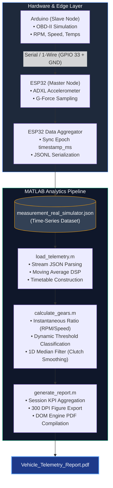

\# 🏎️ Vehicle Telemetry Analytics \& Transmission Gear Estimation


An end-to-end MATLAB data-processing pipeline designed for automotive telemetry ingestion, digital signal processing (DSP), kinematic performance analysis, and automated manual transmission gear detection from real-world OBD-II / CAN-bus logged sessions.


\---


\## 📌 Overview


Modern vehicle diagnostics and performance engineering rely heavily on clean, time-synchronized telemetry data. This project provides a robust post-processing suite that ingests multi-node JSONL telemetry streams recorded via embedded microcontrollers (ESP32/Arduino) and real car, applies noise reduction filters, extracts key dynamic metrics, and classifies the active transmission gear ratio without dedicated transmission gear sensors.


\---


\## ⚙️ Key Features


*Multi-Node JSONL Stream Ingestion:\*\* Parses nested telemetry packets containing engine parameters (`RPM`, `Vehicle Speed`, `Coolant/Oil Temperatures`, `Engine Load`) and inertial IMU data (`G-Force`).

*Time-Series Synchronization:\*\* Reconstructs continuous time domains and structures raw asynchronous data into high-performance MATLAB `timetable` objects.

*Digital Signal Processing (DSP):\*\* 

&#x20; * Implements Moving Average filtering (`movmean`) to denoise high-frequency vibrations from MEMS accelerometer signals.

&#x20; * Employs 1D Median Filtering (`medfilt1`) to suppress transient gear-shifting chatter during clutch engagement/disengagement.

*Automated Transmission Gear Detection:\*\*

&#x20; \* Computes the continuous transmission ratio:

&#x20;   $$R(t) = \\frac{\\text{Engine RPM}(t)}{\\text{Vehicle Speed}(t)}$$

&#x20; \* Analyzes ratio frequency distributions (scatter clustering \& histograms) to dynamically segment operating windows for Gears 1 through 6 and Neutral/Coasting.

\* \*\*Synchronized Multi-Axis Visualization:\*\* Plots dual-axis engine dynamics, thermal health metrics, and discrete gear stair traces over time.


\---

---

\## 📐 System Architecture & Data Pipeline

The project implements an end-to-end edge-to-analytics pipeline, collecting telemetry data from physical/simulated automotive ECUs and running DSP and kinematic gear classification inside MATLAB.

** Operating diagram for [Automotive Telemetry Acquisition System] project



\## 📊 Analytics \& Visualizations


The script generates comparative analytical figures:

1\. \*\*RPM vs. Speed Scatter \& Ratio Histogram:\*\* Maps transmission cluster slopes to identify mechanical gear boundaries.

2\. \*\*Dynamic Vehicle Dashboard:\*\* Synchronized multi-subplot tracking RPM, road speed, denoised G-force, thermal behavior, and active gear engagement.


\---


\## 🚀 Getting Started


\### Prerequisites

\* MATLAB R2020b or newer

\* Signal Processing Toolbox (recommended)


\### Running the Pipeline

1\. Clone the repository:

&#x20;  ```bash

&#x20;  git clone \[https://github.com/EdwardM88/Vehicle-telemetry-analytics-matlab.git](https://github.com/EdwardM88/Vehicle-telemetry-analytics-matlab.git)

&#x20;  cd Vehicle-telemetry-analytics-matlab

2\. Open MATLAB and set the project directory as the current working folder.

3\. Place your telemetry file (measurement\_real\_simulator.json) in the root directory.

4\. Run the main processing script.


\## 🔗 Related Repositories \& Ecosystem

This data analytics pipeline is part of a larger automotive telemetry ecosystem:	

&#x09;\* \[Automotive Telemetry Acquisition System](https://github.com/EdwardM88/Automotive-Telemetry-Acquisition-System) – Low-level C++ PlatformIO firmware running on ESP32 \& Arduino for real-time CAN/OBD-II data acquisition and IMU logging.

&#x09;\* \[ESP32-OBD2-Telemetry-System](https://github.com/EdwardM88/ESP32-OBD2-Telemetry-System) - Low-level C++ PlatformIO firmware running on ESP32 \& OBD-II car port for data acquisition.


\## 📈 Future Enhancements

&#x09;\* \[] Automated PDF technical report generation with session KPIs and high-res vector figures.

&#x09;\* \[] Frequency spectrum vibration analysis via Fast Fourier Transform (FFT).

&#x09;\* \[] Model-in-the-Loop (MIL) validation with physical vehicle dynamics models in Simulink.

